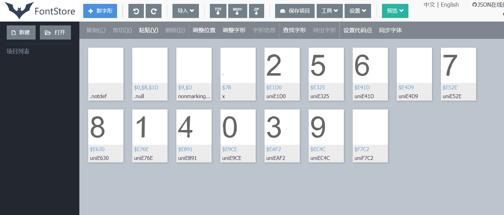
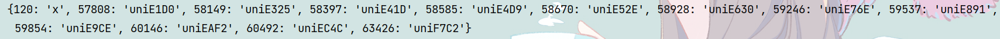

观察发现，静态网页虽然有数据，但是保存下来后出现js代码，估计反爬虫

发现接口，且接口访问容易，只需要突破字体反爬


分析一下编码


下载字体，从woff2转到woff



用python试着分析下



结果一致，我们直接将uni编码与数字的映射关系写死（数据量不大）

```
font_relation_map = {
    'uniE9CE': 0,
    'uniE41D': 1,
    'uniE630': 2,
    'uniEAF2': 3,
    'uniE325': 4,
    'uniE891': 5,
    'uniEC4C': 6,
    'uniE1D0': 7,
    'uniE76E': 8,
    'uniE52E': 9
}
```


然后从中取出键值对进行网页上&#59246格式的映射

```
code_name_map = font.getBestCmap()
print(code_name_map)
new_code_name_map = {}
for index, key in enumerate(code_name_map):
    value = code_name_map[key]

    # 捕获异常
    try:
        temp = font_relation_map[value]
    except:
        temp = ''
    if temp != '':
        # 根据响应结果中字体反爬数据格式，将键值前面添加字符串&#，用于匹配
        new_code_name_map['&#' + str(key) + ";"] = temp

print(new_code_name_map)
```

得到


访问接口后对数据进行替换

```
url = 'https://mapi.guazi.com/car-source/carList/pcList?versionId=0.0.0.0&sourceFrom=wap&deviceId=d4e7f30a-20c1-487e-b743-8decba22c665&osv=Windows+10&minor=dazhong&sourceType=&ec_buy_car_list_ab=&location_city=&district_id=&tag=-1&license_date=&auto_type=&driving_type=&gearbox=&road_haul=&air_displacement=&emission=&car_color=&guobie=&bright_spot_config=&seat=&fuel_type=&order=&priceRange=0,-1&tag_types=&diff_city=&intention_options=&initialPriceRange=&monthlyPriceRange=&transfer_num=&car_year=&carid_qigangshu=&carid_jinqixingshi=&cheliangjibie=&page=2&pageSize=20&city_filter=12&city=12&guazi_city=12&qpres=581687304558096384&platfromSource=wap'
r = requests.get(url)
# print(r.text)
import json
data = r.text
for k,v in new_code_name_map.items():
    if k in data:
        data = data.replace(k, str(v))
print(data)
```

